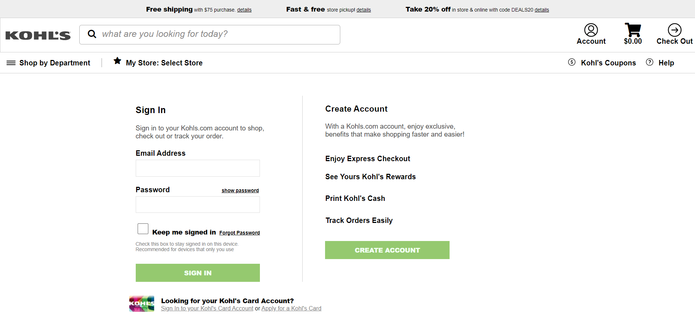
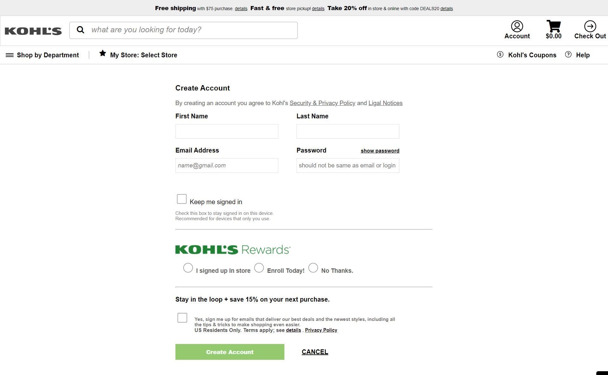
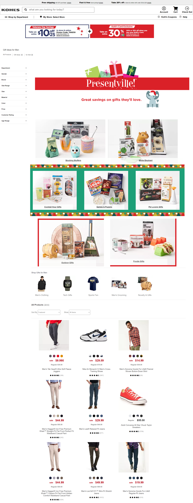
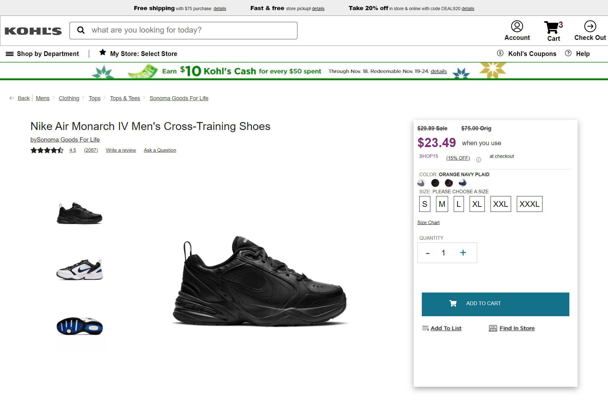
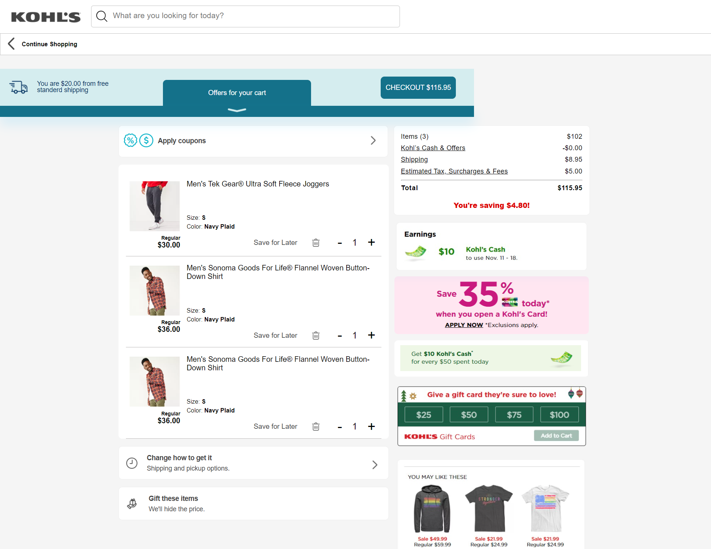

# kohls_clone
Kohl's Clone -- Kohl’s is an American online marketplace for Clothing, Kitchen, Toys & Home Decor; More

In this Project we made clone of Kohl's departmental store company web application with our ability and strength in technology stack that we learned so far in the Masai School,we were able to clone the
frontend of [Kohl's](https://www.kohls.com/).This project is build as a part of masai school(30 weeks of boot camp) curriculam project and completed in a duration of 6 days with team of 6.

## Tech Stack
<!-- 
 -->
- HTML , CSS , Bootstrap
- JAVASCRIPT
- Browser LocalStorage for Frontend

- [Github page](https://chamarthivamsidev.github.io/kohls_clone/home.html)

  ## Features 
<!-- --- -->
- User can Signin and Create account functionality on home page.
- User can select particular category products with sorting price functionality on product page.
- User can select quantity of the product and can add to the cart on product description page
- User can add and remove multiple products to their cart with total price details.
- On Checkout page price is calculated dynamically and can place order.

## Steps to navigate the website:

- On the Home Page header, user can click on the 'Account' Icon to either Sign In or Create account to shop.
- Once the user has logged in, they redirected to the Home Page.
- On the top nav-bar, the user can navigate to the following categories or can select Men shopping

- On the Products Page 
  - User can experience the men's arrival of clothing, shoes of 48 products.
  - Sorting operation of products on price
  - On product description page Size and Quantity can be added to the cart. 
  
- On the Cart page
  - User can add and remove a product from the cart.
  - Total Amount can be added dynamically and proceed to checkout button.

- On Payment page, the user is supposed to
  - Fill their First name, Last name ,Phone number Shipping address and Zip code.
  - Enter their temporary Credit/Debit card details for payment.
  - User can Place the Order by product summary.

## Screenshots
A glimpse of our website

**Home Page:**

**Signin Page:**

**Signup Page:**

**Product Page:**

**Product Description Page:**

**Checkout Page:**

